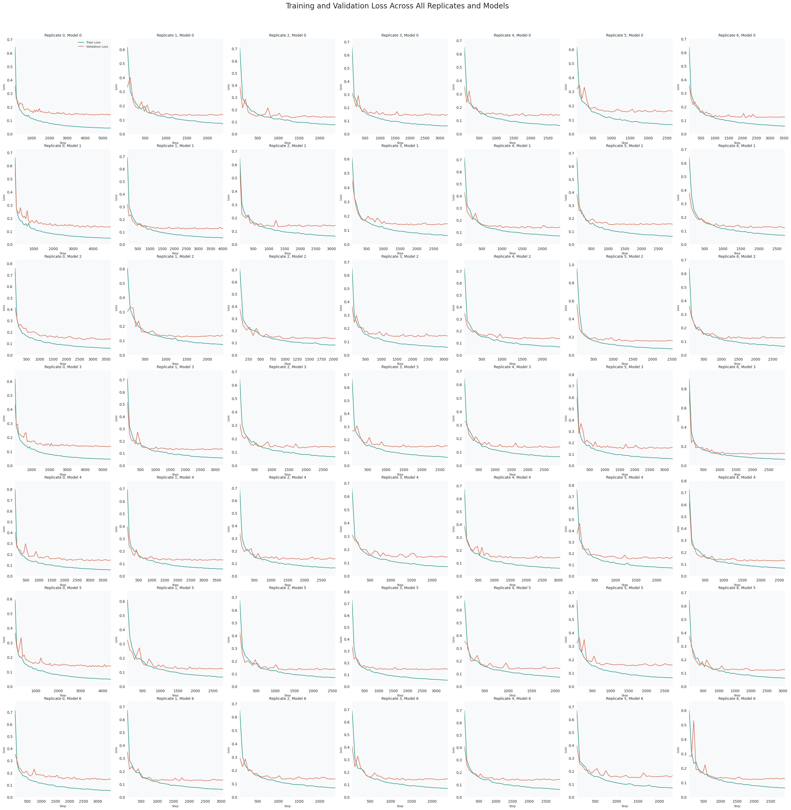
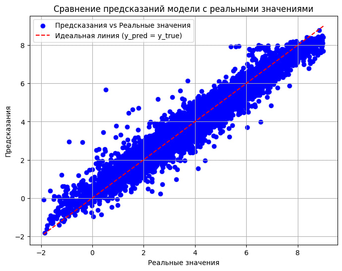

# Chemprop LogP Prediction

## Описание

Этот проект был разработан в рамках участия в конкурсе [Элемент 119](https://element119-ai.ru/) — соревнования по применению **искусственного интеллекта в химии** от **СИБУРа**. Проект предназначен для предсказания липофильности органических молекул (LogP) с использованием модели машинного обучения, основанной на графовых нейронных сетях (GNN) с помощью библиотеки **Chemprop**. Модель обучается на данных, содержащих молекулы в формате SMILES и соответствующие значения LogP.

## Цели проекта

1. Разработка модели для предсказания значения LogP на основе структуры молекулы.
2. Применение методов машинного обучения для химической информатики.
3. Оценка производительности модели с использованием метрики RMSE.

## Файлы

- `train.ipynb` — обучение модели
- `README.md` — документация для проекта
- `img/` — графики

## Результаты
- 📈 RMSE на публичной части: 0.57779
- 📉 RMSE на приватной части: 0.66125
- 🏆 8 место в лидерборде

  
    
  

